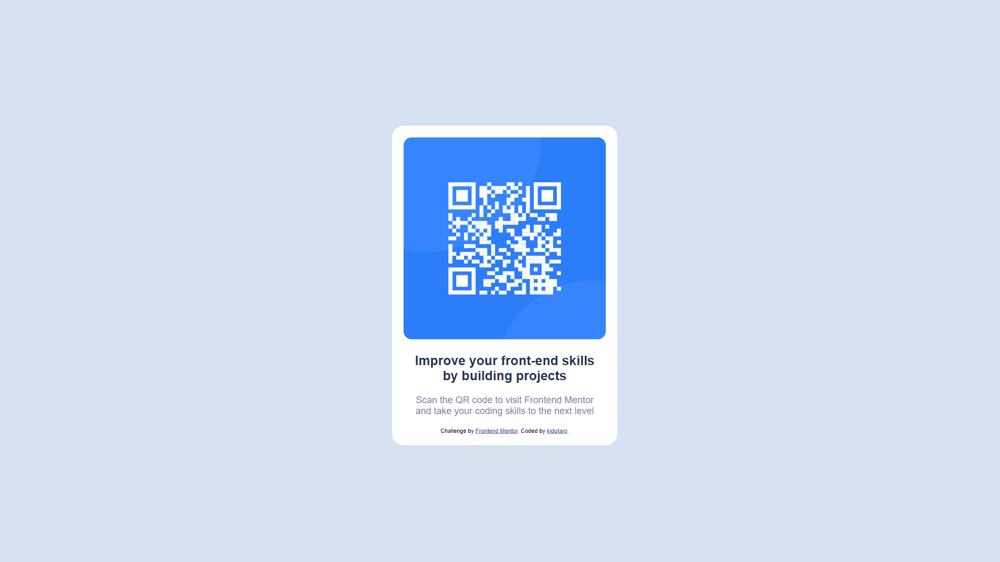

# Frontend Mentor - QR code component solution

This is a solution to the [QR code component challenge on Frontend Mentor](https://www.frontendmentor.io/challenges/qr-code-component-iux_sIO_H).

## Table of contents

- [Frontend Mentor - QR code component solution](#frontend-mentor---qr-code-component-solution)
  - [Table of contents](#table-of-contents)
  - [Overview](#overview)
    - [Screenshot](#screenshot)
    - [Links](#links)
  - [My process](#my-process)
    - [Built with](#built-with)
    - [What I learned](#what-i-learned)
    - [Continued development](#continued-development)
  - [Author](#author)

**Note: Delete this note and update the table of contents based on what sections you keep.**

## Overview

This is a quick project of a QR code component that I wrote from the design that was provided from the site.

### Screenshot

### Links

- Solution URL: [Solution](https://github.com/kjdutaro/frontend-learning-journey/tree/b60674dd44eeb5e4302771bdb0cc5021ac9c1698/qr-code-component-main)
- Live Site URL: [QR Code](https://qr-code-component-main-coral-one.vercel.app/)

## My process

### Built with

- Semantic HTML5 markup
- CSS custom properties

### What I learned

I know that this is just going back to basics. I played with the custom layout a bit and tried to at least copy the design provided as close as possible. I did struggle a bit on how to center the component vertically with flex but instead opted to use transform instead.

### Continued development

I will be trying to maybe replicate this with tailwindcss soon.

## Author

- Email - [kjdutaro@gmail.com]
- Frontend Mentor - [@kjdutaro](https://www.frontendmentor.io/profile/yourusername)
